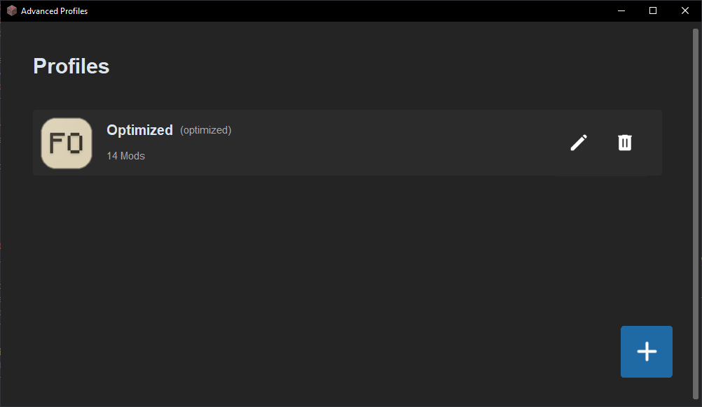
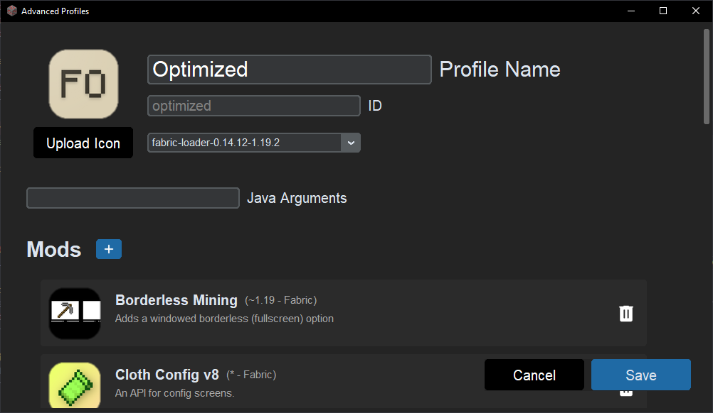

# Advanced Profiles
A simple profile manager for Minecraft Java Edition. Easily switch between different versions, mods, and resource packs. To launch the game, you use the official launcher - so no need to worry about security.

## Features
- Manage multiple profiles
- Switch between versions (including modded versions)
- Switch between resource packs
- Switch between mods

## Installation
1. Download the latest release from the releases page.
2. Extract the zip file to a folder of your choice.
3. Run `AdvancedProfiles.exe`.

## Screenshots


---


---
<br>
Profile in the official launcher.

## Todos
- [ ] Add support for modpacks
- [ ] Hide additional window when launching game
- [ ] Settings screen
- [ ] Smaller folder size
- [ ] Auto update mods (maybe)

## Settings
If you need to configure your minecraft save location or your java home location, you can do so by editing the `AdvancedProfiles/config/settings.json` file.

## Security
Because it uses the official launcher, you the credentials of your account are never exposed to this program. It works by configuring the java path of its profiles to the interferer.exe. This means that the launcher will launch the interferer.exe, which will then launch the game. The arguments contain the access token, which could be used to log in to your account. However, you can look at the source code (`interferer.py`) at the `arguments` and `sys.argv` variables to see that they are not being used for anything malicious.

## Build it yourself
```ps1
python -m PyInstaller AdvancedProfiles.spec -y
```